# Expo React Native Google Sign with Supabase

Expo React Native app with Google Sign In using [`react-native-google-signin/google-signin`](https://github.com/react-native-google-signin/google-signin)
very simple for learning purposes with Nativewind (Tailwind CSS) and Supabase

google sign library web [WEB react-native-google-signin](https://react-native-google-signin.github.io/)

Central project  [expo-react-native-google-signin-simple](https://github.com/diegoperea20/expo-react-native-google-signin-simple)

<p align="center">
  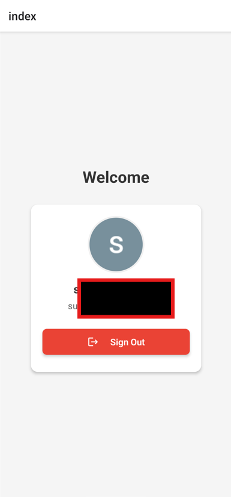
</p>

<p align="center">
  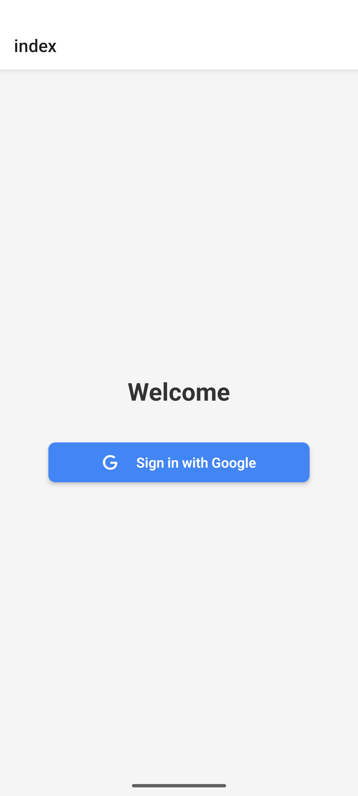
</p>

----


This is an [Expo](https://expo.dev) project created with [`create-expo-app`](https://www.npmjs.com/package/create-expo-app).

## Get started

1. Install dependencies

   ```bash
   npm install
   ```

2. Run the app for android folder 

```bash
   npm expo run:android
   ```

or

Run the app for ios folder 

```bash
   npm expo run:ios
   ```


3. Start the app

   ```bash
   npx  start
   ```

In the output, you'll find options to open the app in a

- [development build](https://docs.expo.dev/develop/development-builds/introduction/)
- [Android emulator](https://docs.expo.dev/workflow/android-studio-emulator/)
- [iOS simulator](https://docs.expo.dev/workflow/ios-simulator/)
- [Expo Go](https://expo.dev/go), a limited sandbox for trying out app development with Expo

You can start developing by editing the files inside the **app** directory. This project uses [file-based routing](https://docs.expo.dev/router/introduction).


This command will move the starter code to the **app-example** directory and create a blank **app** directory where you can start developing.

## Learn more

- [Expo documentation](https://docs.expo.dev/): Learn fundamentals, or go into advanced topics with our [guides](https://docs.expo.dev/guides).

------

------

## Create a new project

Prerequisites:

- [Node.js](https://nodejs.org/en/download/)
- [Expo](https://docs.expo.dev/guides/installation/)
- [Android Studio](https://developer.android.com/studio)

In windows in for android studio put the path of the jdk in the environment variables and the path of the android studio in the environment variables:

<p align="center">
  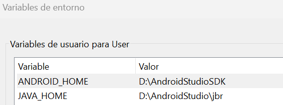
</p>

```bash
ANDROID_HOME = path\to\AndroidSdk
# example ANDROID_HOME = C:\Users\ProgramFiles\AppData\Local\AndroidSdk
JAVA_HOME = path\to\JDK
# example JAVA_HOME = C:\Users\ProgramFiles\AppData\Local\Android\jbr
```

---

For create a new project:

```bash
npx create-expo-app@latest <project-name>
# example npx create-expo-app google-native
```

## Get a fresh project

When you're ready, run:

```bash
npm run reset-project
```

Run the app for the android folder, which takes approximately 30 minutes to run depending on the speed of your computer, when it's done it will run the app in the android emulator.

```bash
   npm expo run:android
```

Create .env file in the root of the project and add the following or copy the .env.example file to .env:

```bash
#WEB
GOOGLE_CLIENT_ID_WEB= your_google_client_id_web
GOOGLE_CLIENT_SECRET_WEB= your_google_client_secret_web
#ANDROID
GOOGLE_CLIENT_ID_ANDROID= your_google_client_id_android
#OS
GOOGLE_CLIENT_ID_IOS= your_google_client_id_ios
#SCHEMA URL of iOS
IOS_URL_SCHEMA=    
#SUPABASE
EXPO_PUBLIC_SUPABASE_URL= your_supabase_url
EXPO_PUBLIC_SUPABASE_KEY= your_supabase_key
```
for doing this go to the [google console](https://console.developers.google.com/) and create a new project and add the android and ios client ids.

<p align="center">
  
</p>


IN WEB:
<p align="center">
  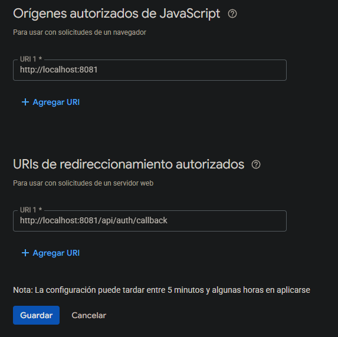
</p>


IN ANDROID:
<p align="center">
  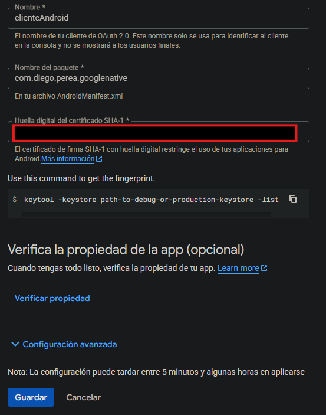
</p>

<p align="center">
  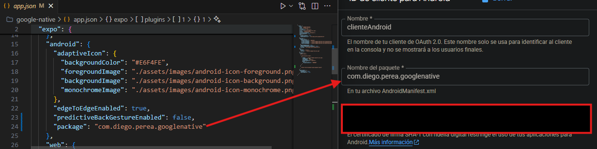
</p>


for command to get the debug keystore original:

```powershell
keytool -keystore path-to-debug-or-production-keystore -list -v
```


for command to get the debug keystore in powershell:

```powershell
& "D:\AndroidStudio\jbr\bin\keytool.exe" -list -v -keystore "android/app/debug.keystore" -alias androiddebugkey -storepass android -keypass android
```

IN IOS:
<p align="center">
  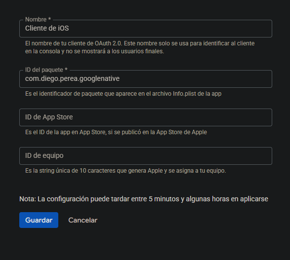
</p>

library used:

```bash
npm i @react-native-google-signin/google-signin@latest
npx expo install @react-native-google-signin/google-signin expo-dev-client
npx expo install expo-constants
```

## SUPABASE

For use SUPABASE you need to run the following commands in the web :
### [SUPABASE](https://supabase.com/)

for Expo React native supabase use [supabase-js](https://supabase.com/docs/reference/javascript/typescript-support)

```bash
npm install @supabase/supabase-js
```

In supabase create a new project  and create a table named "accounts" with the following columns:

| Name                | Format | Type    | Description |
|---------------------|--------|---------|-------------|
| id                  | text   | string  |             |
| user_id             | text   | string  |             |
| type                | text   | string  |             |
| provider            | text   | string  |             |
| provider_account_id | text   | string  |             |
| refresh_token       | text   | string  |             |
| access_token        | text   | string  |             |
| expires_at          | integer| number  |             |
| token_type          | text   | string  |             |
| scope               | text   | string  |             |
| id_token            | text   | string  |             |
| session_state       | text   | string  |             |


<p align="center">
  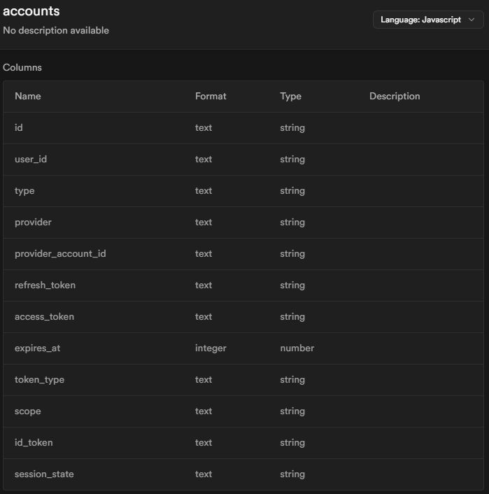
</p>

Disable RLS in the table "accounts" in supabase:

<p align="center">
  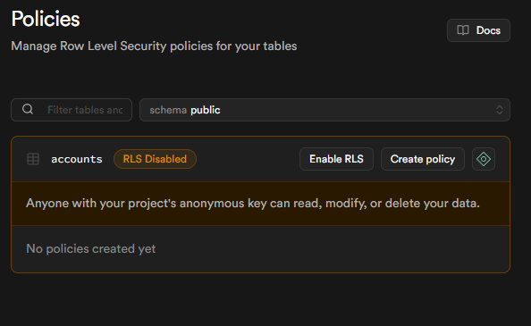
</p>

Example of working with the table "accounts" in supabase:

<p align="center">
  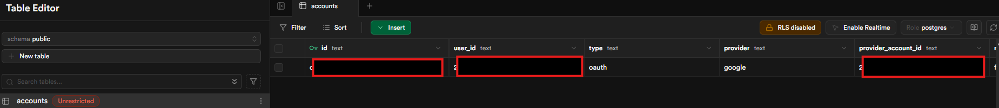
</p>


Enable Google in Auth supabase:
<p align="center">
  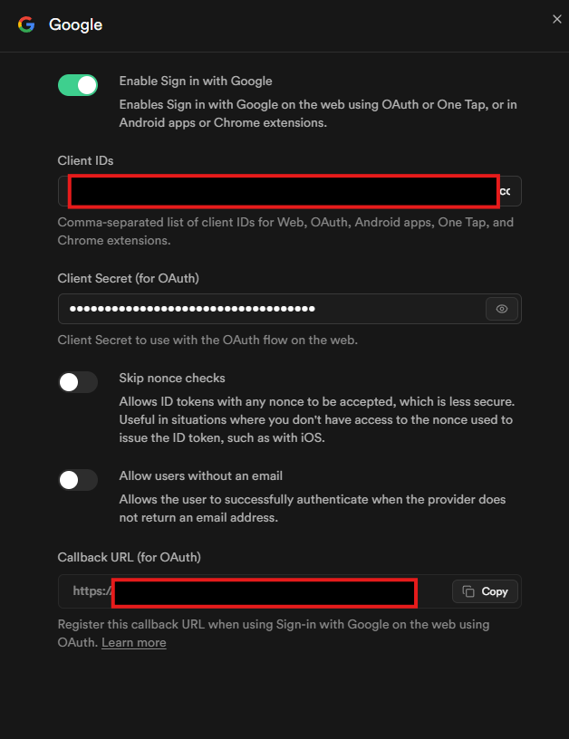
</p>


So now create a new table in supabase named "users" with the following columns:

| Name      | Format                    | Type     |
|-----------|---------------------------|----------|
| id        | text                      | string   |
| createdAt | timestamp without time zone | string   |
| updatedAt | timestamp without time zone | string   |
| name      | text                      | string   |
| email     | text                      | string   |
| image     | text                      | string   |


<p align="center">
  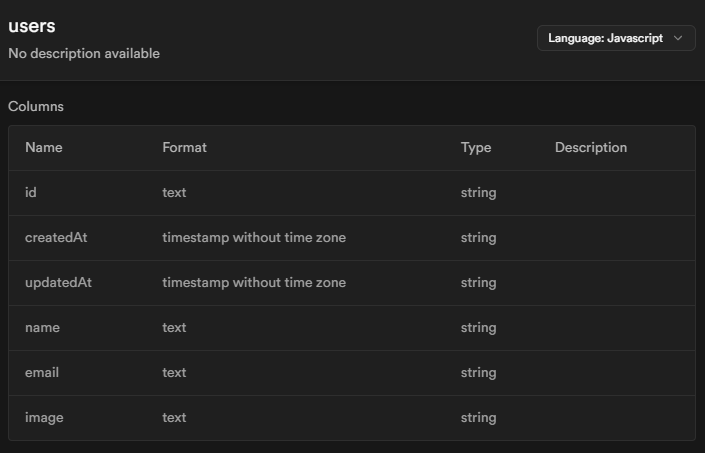
</p>

> **Note:** Very important to disable RLS in the table "users" in supabase and
edit column "user_id" of table accounts

<p align="center">
  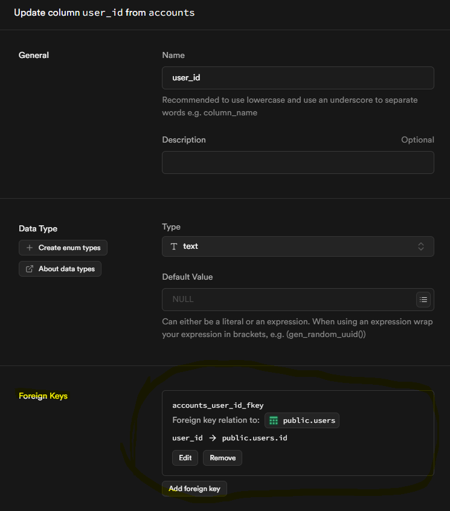
</p>


<p align="center">
  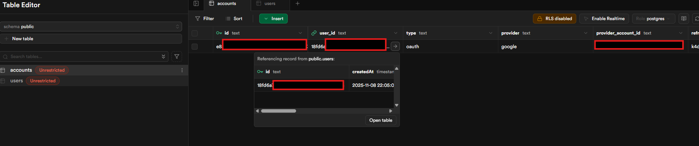
</p>


----


### 📄 License

This project is licensed under the MIT License - see the [LICENSE](LICENSE) file for details.

---

## 👨‍💻 Author / Autor

**Diego Ivan Perea Montealegre**

- GitHub: [@diegoperea20](https://github.com/diegoperea20)

---

Created by [Diego Ivan Perea Montealegre](https://github.com/diegoperea20)